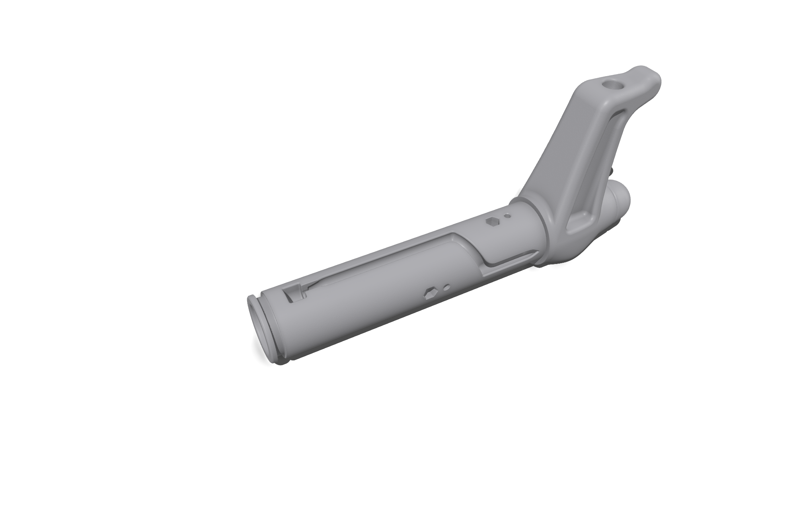
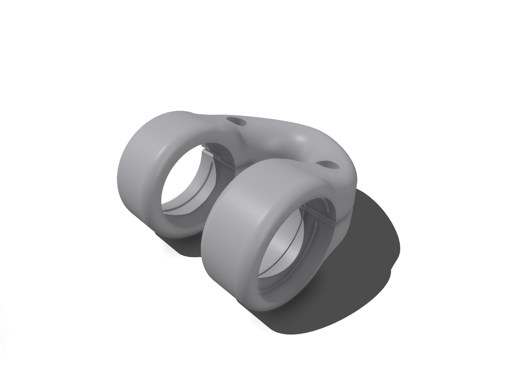
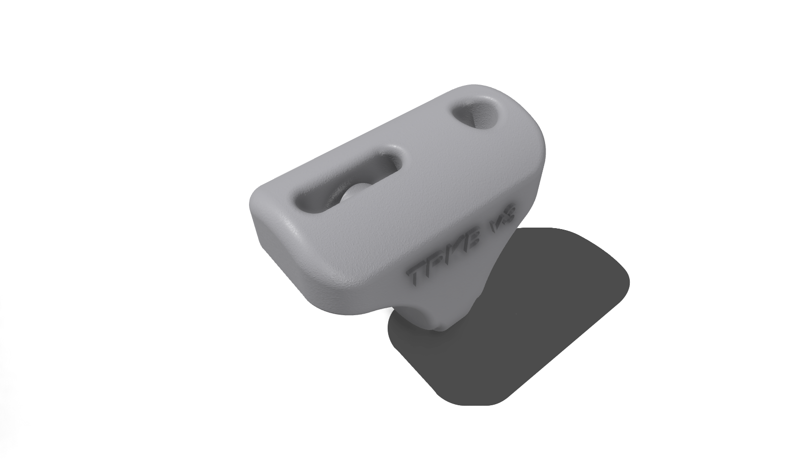

# ThePerfectKiteBar (TPKB)

An **open-source kite control bar** designed for all **chill kite-foil enthusiasts**.  

  
  

## Key Features

- **Lightweight Design** – Optimized for durability and performance.  
- **Customizable Length** – Adjustable to suit various riding styles.  
- **Easy-to-Replace Components** – Modular parts for effortless maintenance.
- **Open source design** – Transparent design to allow anyone to improve parts or make variations.

## Table of Contents

## **Table of Contents**
- [ThePerfectKiteBar (TPKB)](#theperfectkitebar-tpkb)
  - [Key Features](#key-features)
  - [Table of Contents](#table-of-contents)
  - [**Table of Contents**](#table-of-contents-1)
  - [Materials List](#materials-list)
  - [**Tools Required**](#tools-required)
  - [**Step-by-Step Instructions**](#step-by-step-instructions)
    - [**Step 1: \[Title\]**](#step-1-title)
    - [**Step 2: \[Title\]**](#step-2-title)
    - [**Step 3: EVA Non-Slip Heat Shrink Tube Installation**](#step-3-eva-non-slip-heat-shrink-tube-installation)
  - [**Parts for Prints**](#parts-for-prints)
    - [**1️⃣ Bar End**](#1️⃣-bar-end)
  - [**Safety Precautions**](#safety-precautions)
  - [**Design Files**](#design-files)
  - [**Testing and Tuning**](#testing-and-tuning)
  - [**Disclaimer**](#disclaimer)
  - [**Contributing**](#contributing)
  - [License](#license)

## Materials List

The following materials are required to assemble **ThePerfectKiteBar**:

- **Carbon Fiber Tube** – [Specify dimensions, supplier link]  
- **Dyneema Line** – [Specify type, length, supplier link]  
- **Quick Release System** – [Specify type, supplier link]  
- *(Add more materials as needed)*  

---

## **Tools Required**
You will need the following tools to assemble the bar:

- **Hacksaw** – For cutting carbon fiber tube.  
- **Drill** – For precision hole-making.  
- **Measuring Tape** – Ensures accurate component placement.  
- *(Add additional tools if necessary)*  

---

## **Step-by-Step Instructions**

### **Step 1: [Title]**
*[Provide a detailed description of the first step. Include images or diagrams for clarity.]*  

### **Step 2: [Title]**
*[Provide a detailed description of the second step. Include images or diagrams for clarity.]*  

### **Step 3: EVA Non-Slip Heat Shrink Tube Installation**
To install the **EVA non-slip heat shrink tube**, follow these steps:

1. Use **100°C boiling water** or a **heat gun** to shrink the tube.  
2. If using a heat gun, apply heat evenly, working from **one end to the middle**, while slowly rotating the bar.  
3. Ensure the tube is **fully heated**; **insufficient heating may cause slipping or stretching** during use.  
4. EVA heat shrink tubing typically **does not shrink lengthwise**, so you can cut it **to the exact required length** before installation.  
5. **Cutting tip:** Use a **scalpel** to cut the tube while it is flat for a clean edge.  
6. **Recommended tube size:**  
   - **25mm diameter** tube fits both **OD 24mm carbon tubes** and **OD 22mm carbon tubes**.  

---

## **Parts for Prints**
The following **3D-printed parts** are required for assembling ThePerfectKiteBar:

### **1️⃣ Bar End**
- **Part Name:** `bar-end_24-22_sls`
- **Technology:** **SLS 3D Printing**
- **Material:** **PA12 Nylon**
- **Fits Cabon tube:** **OD=24mm, ID=22mm**
- **Length inside tube:** **100mm**
- **Length to rope:** **25mm**

**🔹 Bar End Preview:**

***🔹3D Preview:***

[🔗 View 3D Model](hardware/bar/carbon_tube_od24_id22mm/bar_end/leader_line_3mm/variant_7/bar-end_24-22_sls.stl)

**🔹Center Piece Preview:**

***🔹3D Preview:***

[🔗 View 3D Model](hardware/bar/carbon_tube_od24_id22mm/bar_center_piece/variant_7/bar-center-piece_24-22_m3_sls.stl)

**🔹V-Splitter Preview:**

***🔹3D Preview:***

[🔗 View 3D Model](hardware/trim/sheeting_rope_4mm/front_line_1.7mm/v-splitter/variant_3/v-splitter_4x17_mjf.stl)

*(More parts will be added here as needed.)*

---

## **Safety Precautions**
Please follow these safety guidelines when assembling and using the kite bar:

- ⚠ **Wear Safety Gear** – Always wear **safety glasses and gloves** when cutting materials.  
- ⚠ **Secure Components** – Ensure **lines and hardware** are properly attached before applying tension.  
- ⚠ **Use Heat Tools with Caution** – When using a heat gun or boiling water, handle materials carefully to **avoid burns**.  
- *(Add more safety notes as necessary)*  

---

## **Design Files**
Download the latest **CAD and 3D printing files**:

- [🔗 Link to CAD files](link-to-cad-files)  
- [🔗 Link to 3D printing files](link-to-3d-printing-files)  

---

## **Testing and Tuning**
Before using **ThePerfectKiteBar**, ensure optimal performance by following these steps:

- **Strength Testing** – Apply load gradually to verify the bar’s durability.  
- **Balance Check** – Ensure the control bar is symmetrical for even response.  
- **Line Tension Adjustment** – Tune the flying lines for **optimal kite control**.  
- *(Add more testing steps if required)*  

---

## **Disclaimer**
This project is provided **"as is"**, without **any warranty**. The author is **not responsible** for any injuries or damages resulting from the use of this guide. Use at **your own risk**.  

---

## **Contributing**
Want to improve **ThePerfectKiteBar**? Contributions are welcome!  

- **Fork the repository** on GitHub.  
- **Make your modifications** and **submit a pull request**.  
- Open an issue for **bug reports, feature requests, or questions**.  

## License

This project is licensed under the **Creative Commons Attribution-NonCommercial**
