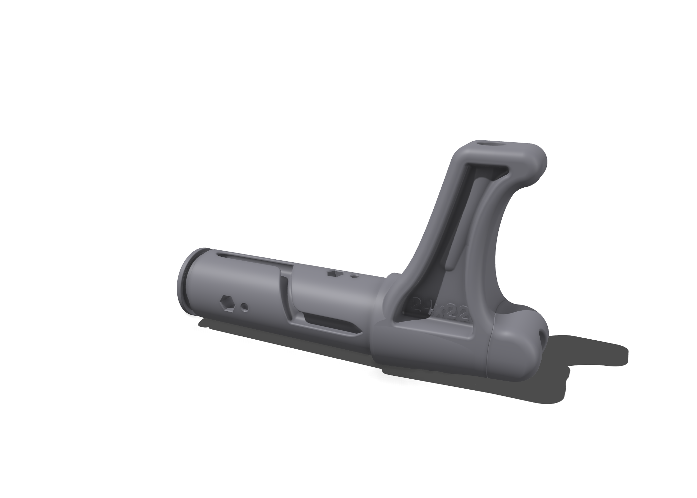
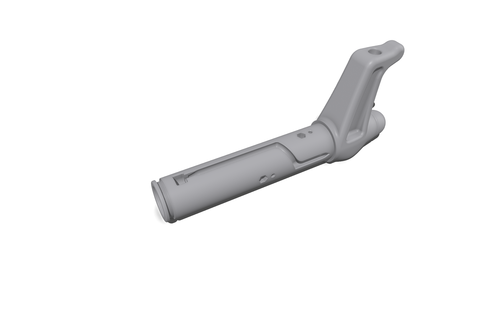
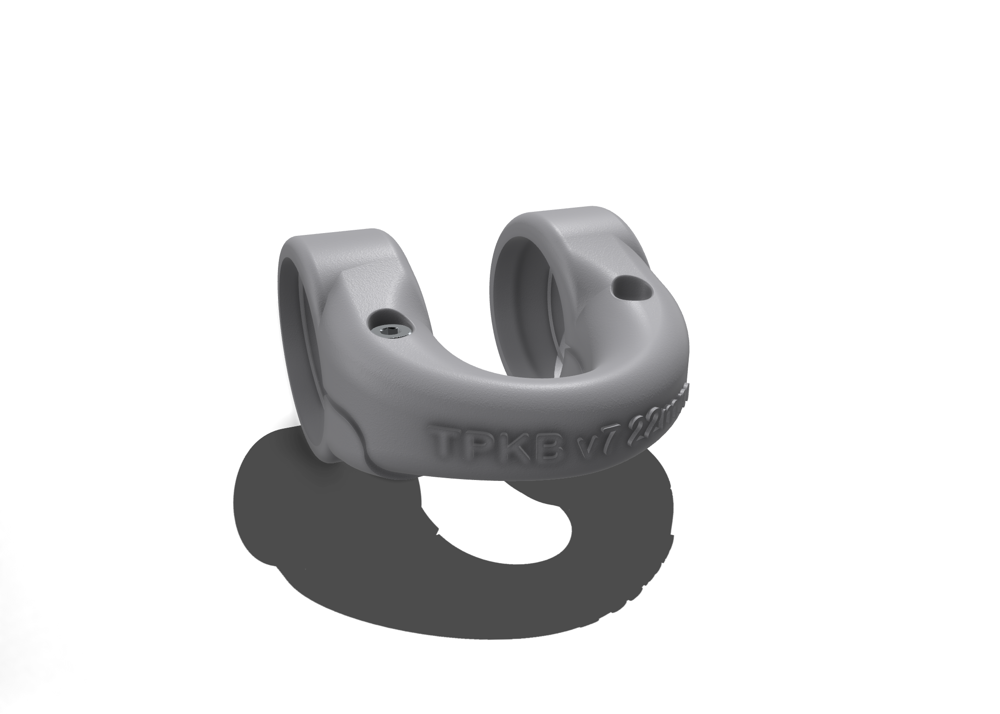
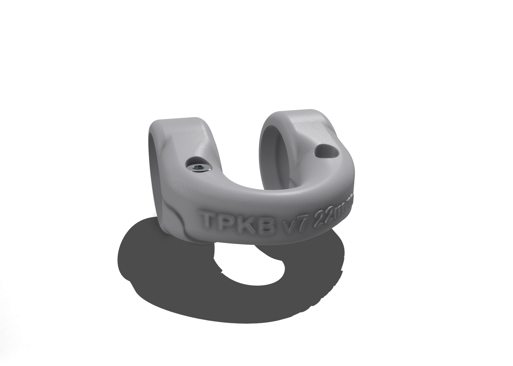
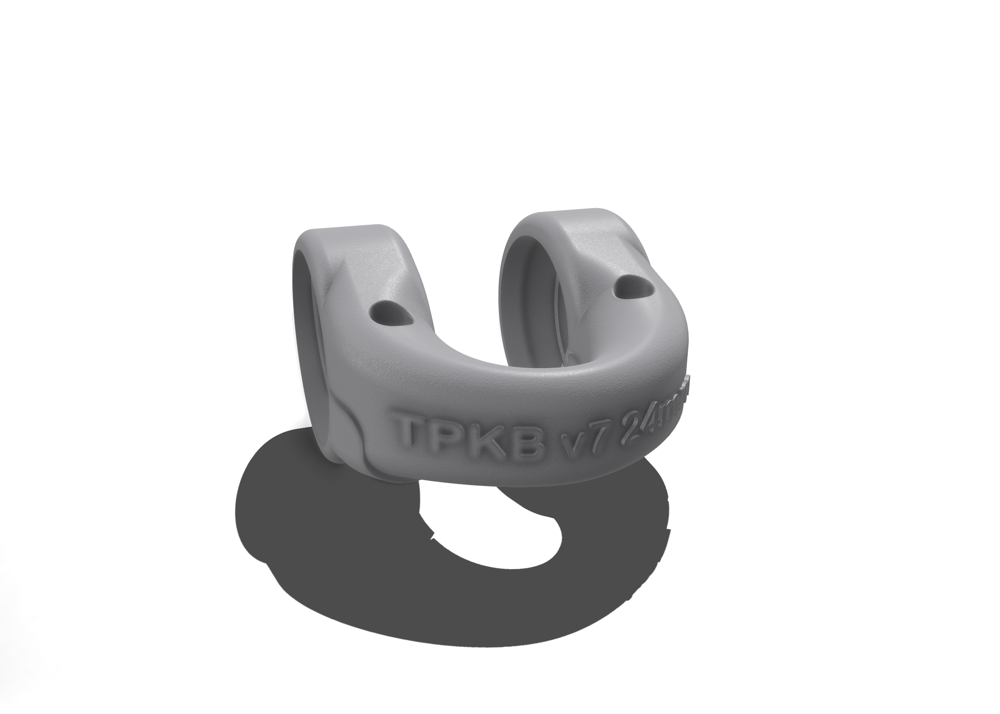
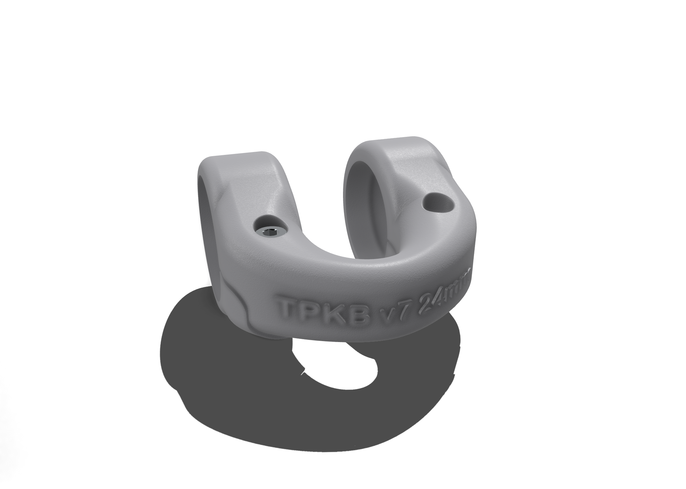

# Bar Component

The **Bar** is the core structural element of ThePerfectKiteBar system. It consists of a carbon fiber tube, two protective **Bar Ends** (which secure the steering/leader lines), and a **Central Piece** (which routes the sheeting and safety lines).

To accommodate different weight and durability requirements, we support two separate sizing tracks based on the carbon tube dimensions:
1. **OD 22mm / ID 20mm Track**: Optimized for lighter weight, smaller hands, and compact/joystick bars.
2. **OD 24mm / ID 22mm Track**: The standard, highly robust profile suitable for all-round conditions.

---

## 1. Bar Ends

The Bar Ends insert 100mm inside the carbon tube to reinforce it against bending stress, channel the steering lines, and provide a secure winding surface.

| Carbon Tube Size | Leader Line | Variant 5 (Standard Sweep) | Variant 7 (Contoured / Reinforced) | Subfolder |
|------------------|-------------|----------------------------|----------------------------|-----------|
| **OD 22mm / ID 20mm** | 2.5mm max |  |  | [`22mm Bar Ends`](carbon_tube_od22_id20mm/bar_end) |
| **OD 24mm / ID 22mm** | 3.0mm max |  |  | [`24mm Bar Ends`](carbon_tube_od24_id22mm/bar_end) |

---

## 2. Center Pieces

The Central Piece snaps over the middle of the carbon tube. It contains the low-friction entry/exit guide for the polyurethane-covered sheeting lines and safety lines.

All center pieces use the optimized **Variant 7** geometry, but come in two versions based on the securing bolt diameter:

* **2.5mm Bolt version**: Offers a smaller center-recess footprint and maximum weight saving.
* **3mm Bolt version**: Provides a larger, heavier-duty connection for maximum strength.

| Carbon Tube Size | 2.5mm Bolt Version (Compact) | 3mm Bolt Version (Robust) | Subfolder |
|------------------|-----------------------------|---------------------------|-----------|
| **OD 22mm / ID 20mm** |  |  | [`22mm Center Piece`](carbon_tube_od22_id20mm/bar_center_piece) |
| **OD 24mm / ID 22mm** |  |  | [`24mm Center Piece`](carbon_tube_od24_id22mm/bar_center_piece) |

---

## Materials & Sourcing

1. **Carbon Tube**:
   - Buy a pull-wound or roll-wrapped carbon fiber tube (3K gloss or matte) with your choice of track dimensions:
     - 22mm outer diameter / 20mm inner diameter (wall thickness 1mm)
     - 24mm outer diameter / 22mm inner diameter (wall thickness 1mm)
   - Cut to your preferred bar length (usually between 45cm and 55cm).
2. **3D Printing**:
   - **Technology**: Selective Laser Sintering (**SLS**) is highly recommended.
   - **Material**: **PA12 Nylon** (unpolished or polished). Avoid SLA or standard FDM PLA/PETG as they lack the impact resistance and flexibility needed for high-load kite control systems.
3. **Hardware**:
   - For 22mm Central Piece: M2.5 or M3 socket head bolt (length 12mm)
   - For 24mm Central Piece: M2.5 or M3 socket head bolt (length 14mm)
   - Glue for Bar Ends: Marine grade epoxy (e.g., West System) or flexible polyurethane adhesive (e.g., 3M 5200).

---

## Native Shapr3D Design Files

The following `.shapr` files are the editable source models created in Shapr3D. Each file includes full parametric definitions—sketches, constraints, and feature history—so you can open and modify them directly in Shapr3D (iOS/iPadOS/macOS).

<!-- BEGIN_SHAPR_TABLE -->
<!-- Auto-generated Shapr3D download table. Do not edit manually. -->
| File | MD5 | Last Modified | Download URL |
|------|-----|---------------|--------------|
| `bar-center-piece_22_m2.5x12_sls.shapr` | `dbb2e7d7f3a93d92e606cccd7b349d44` | 2025-05-02 03:57:23 | [Download](https://storage.googleapis.com/theperfectkitebar-cad-assets/bar/carbon_tube_od22_id20mm/bar_center_piece/variant_7/bar-center-piece_22_m2.5x12_sls.shapr) |
| `bar-center-piece_22_m3x12_sls.shapr` | `90e041ad71556d7bbd5cdc6f9af44f42` | 2025-06-07 20:08:35 | [Download](https://storage.googleapis.com/theperfectkitebar-cad-assets/bar/carbon_tube_od22_id20mm/bar_center_piece/variant_7/bar-center-piece_22_m3x12_sls.shapr) |
| `bar-end_22-20_sls.shapr` | `1b0e33c67c1ef51686e6ca508431f07c` | 2025-05-02 03:57:32 | [Download](https://storage.googleapis.com/theperfectkitebar-cad-assets/bar/carbon_tube_od22_id20mm/bar_end/leader_line_2.5mm/variant_5/bar-end_22-20_sls.shapr) |
| `bar-end_22-20_sls.shapr` | `8385ef305bdfa2b8d48de34e286412dc` | 2025-05-02 03:57:29 | [Download](https://storage.googleapis.com/theperfectkitebar-cad-assets/bar/carbon_tube_od22_id20mm/bar_end/leader_line_2.5mm/variant_7/bar-end_22-20_sls.shapr) |
| `bar-center-piece_24_m2.5x14_sls.shapr` | `3e2a95272948cef865253b36069fbe39` | 2025-05-02 03:57:11 | [Download](https://storage.googleapis.com/theperfectkitebar-cad-assets/bar/carbon_tube_od24_id22mm/bar_center_piece/variant_7/bar-center-piece_24_m2.5x14_sls.shapr) |
| `bar-center-piece_24_m3x14_sls.shapr` | `8e1177d5e58f46734cf1eaa8ca534c95` | 2025-06-07 20:08:34 | [Download](https://storage.googleapis.com/theperfectkitebar-cad-assets/bar/carbon_tube_od24_id22mm/bar_center_piece/variant_7/bar-center-piece_24_m3x14_sls.shapr) |
| `bar-end_24-22_sls.shapr` | `fcee6fbcd4184e35ccb0ba590740c003` | 2025-06-07 20:08:35 | [Download](https://storage.googleapis.com/theperfectkitebar-cad-assets/bar/carbon_tube_od24_id22mm/bar_end/leader_line_3mm/variant_5/bar-end_24-22_sls.shapr) |
| `bar-end_24-22_sls.shapr` | `7ca763e76f91d14a8032e5b38f5cebf3` | 2025-06-07 20:08:35 | [Download](https://storage.googleapis.com/theperfectkitebar-cad-assets/bar/carbon_tube_od24_id22mm/bar_end/leader_line_3mm/variant_7/bar-end_24-22_sls.shapr) |
<!-- END_SHAPR_TABLE -->
