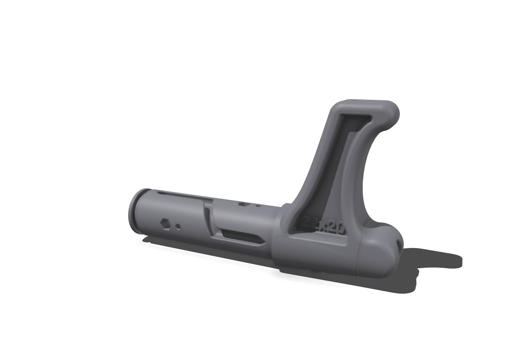
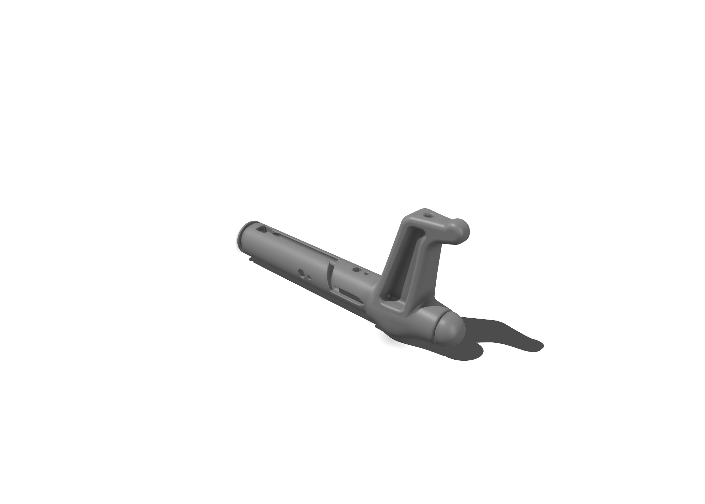

# Bar Ends for 22mm Carbon Tube (OD 22mm / ID 20mm)

This directory contains the design files and specifications for the **Bar Ends** designed to fit a **22mm outer diameter / 20mm inner diameter** carbon tube.

---

## Design Overview

The Bar Ends secure the leader lines (steering lines) to the control bar, provide a comfortable hand grip area, and allow the lines to be wound up neatly when not in use. 

This track uses a **2.5mm channel** designed for **2.5mm leader lines**.

### Variants
We support two variants depending on your preferred bar-end sweep, line attachment style, and geometry:

| Variant | Description | Image Preview |
|---------|-------------|---------------|
| **Variant 5** | Traditional sweep-back angle with optimized weight saving and standard leader line channel routing. Fits the standard bar-end knob. |  |
| **Variant 7** | Refined geometry featuring an updated sweep profile, smoother line entry contours, and a more robust connection socket to prevent stress-fractures under high steering forces. |  |

Both variants require matching **Bar End Knobs** (`bar-end-knob_22-20_sls.stl`) to plug the outer opening and secure the internal knots.

---

## Specifications

- **Compatibility**: Carbon Tube with OD = 22mm, ID = 20mm
- **Leader Line Size**: 2.5mm
- **Manufacturing Technology**: **SLS 3D Printing**
- **Material**: **PA12 Nylon**
- **Insertion Depth inside Tube**: 100mm (ensures rigidity and prevents bending moments from cracking the carbon tube)
- **Files**:
  - Variant 5 files: [`leader_line_2.5mm/variant_5`](leader_line_2.5mm/variant_5)
  - Variant 7 files: [`leader_line_2.5mm/variant_7`](leader_line_2.5mm/variant_7)

---

## Assembly & Installation

1. **Dry Fit**: Slide the bar end socket into the carbon tube. It should be a snug fit. If it's too tight, lightly sand the insert diameter of the plastic piece. If it's loose, wrap a single layer of electrical tape around the insert.
2. **Adhesive**: Apply a high-quality marine epoxy or polyurethane adhesive (such as 3M 5200) inside the carbon tube and on the insert of the bar end.
3. **Insert & Align**: Push the bar end fully into the carbon tube, ensuring the sweep direction is aligned correctly on both ends. Wipe away any excess squeeze-out adhesive.
4. **Leader Line Routing**: Feed the leader line through the internal routing channel.
5. **Secure Knob**: Secure the leader line with a figure-eight knot, slide it into the recess, and snap/epoxy the **Bar End Knob** into place to seal the assembly.
