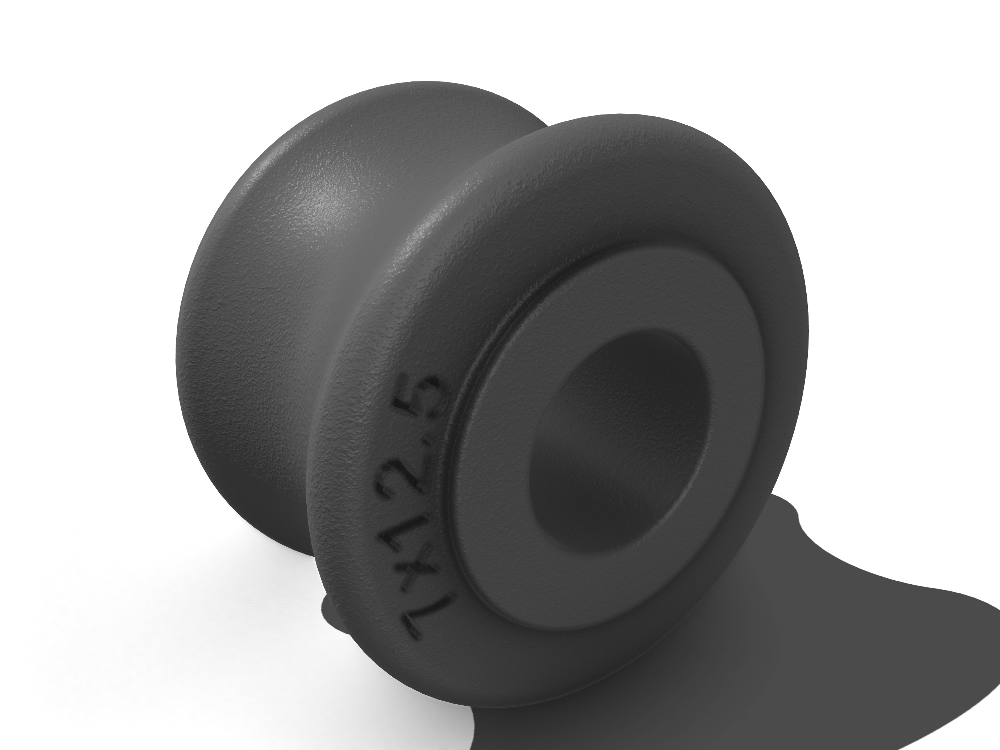

# Quick release

The Quick Release (QR) is a critical safety component of the kite control system. This design focuses on reliability, ease of use (even with gloves in cold water), and field serviceability.

The mechanism consists of 3D-printed parts and flat-cut metal components.

-   **Case**: The main body of the QR is designed for SLS 3D printing in Nylon (e.g., PA12 or Precimid-1172 Pro for a white finish) for durability and impact resistance.
-   **Mechanism**: The internal flat parts are designed to be laser or waterjet cut from Grade 5 Titanium sheets of specific thicknesses (0.125" and 0.187") for maximum strength and corrosion resistance.

This directory contains variants of the QR system that accommodate different bolt sizes (M4 and M6) for attachment.

## Sizing (M4 vs. M6)

The M4 and M6 versions are functionally identical across all variants, with the only difference being the diameter of the attachment bolt.

-   **M4 Version**: A lighter-weight option suitable for most recreational riders.
-   **M6 Version**: A heavier-duty option suitable for heavier riders or more demanding conditions.

Note that for all variants, the upper nut (M4 or M6) that holds the claws must be installed permanently (e.g., using Loctite Threadlocker Red).

## Variants

Variants 1 through 4 have been omitted, as they represent early design iterations that did not proceed to field testing.

### Variant 5 M4

This variant uses a permanent M4 bolt and nut to attach to the harness's sliding rope. It is recommended to use a thread-locking fluid (e.g., Loctite Threadlocker Red) to secure the nut.

Parts needed to build the **M4** version of this variant.

From any laser/waterjet cutting service (e.g., SendCutSend)

| File Name | Parameters | Quantity | Image
|---|---|---|---|
| [`qr_shackle_m4.dxf`](./4mm_bolt/titanium_gr5_0.125_0.187in/variant_5/qr_shackle_m4.dxf) | Material: Grade 5 Titanium, Thickness: 0.125" | 2 pieces ||
| [`qr-claw_m6_for_shackle_m4.dxf`](./4mm_bolt/titanium_gr5_0.125_0.187in/variant_5/qr-claw_m6_for_shackle_m4.dxf) | Material: Grade 5 Titanium, Thickness: 0.125" | 2 pieces ||
| [`qr-claw_m6_for_shackle_m4.dxf`](./4mm_bolt/titanium_gr5_0.125_0.187in/variant_5/qr-claw_m6_for_shackle_m4.dxf) | Material: Grade 5 Titanium, Thickness: 0.187" | 1 piece ||

From a print shop with SLS 3D printing technology (e.g., jlc3dp.com)

| File Name | Parameters | Quantity | Image |
|---|---|---|---|
| [`qr-case_m4_sls.stl`](./4mm_bolt/titanium_gr5_0.125_0.187in/variant_6/qr-case_m4_sls.stl) | Material 3201PA-F Nylon or 1172Pro Nylon | 1 piece || 
| [`slider-rope-wheel_7x12.5.stl`](./4mm_bolt/titanium_gr5_0.125_0.187in/variant_6/slider-rope-wheel_7x12.5.stl) | Material 3201PA-F Nylon or 1172Pro Nylon | 1 piece ||

Additional parts can be procured from hardware suppliers such as aliexpress.com or McMaster-Carr.

- Marine-grade stainless steel M4 bolts, 25mm in length (2 pieces) and 2 nuts.
- Titanium tube for two 13mm spacers with an outer diameter (OD) of 6mm and an inner diameter (ID) of 4mm.

### Variant 5 M6

This variant uses a permanent M6 bolt and nut to attach to the harness's sliding rope. It is recommended to use a thread-locking fluid (e.g., Loctite Threadlocker Red) to secure the nut.

Parts needed to build the **M6** version of this variant.

From any laser/waterjet cutting service (e.g., SendCutSend)

| File Name | Parameters | Quantity | Image |
|---|---|---|---|
| [`qr_shackle_m6.dxf`](./6mm_bolt/titanium_gr5_0.125_0.187in/variant_5/qr_shackle_m6.dxf) | Material: Grade 5 Titanium, Thickness: 0.125" | 2 pieces | |
| [`qr-claw_m8_for_shackle_m6.dxf`](./6mm_bolt/titanium_gr5_0.125_0.187in/variant_5/qr-claw_m8_for_shackle_m6.dxf) | Material: Grade 5 Titanium, Thickness: 0.125" | 2 pieces | |
| [`qr-claw_m8_for_shackle_m6.dxf`](./6mm_bolt/titanium_gr5_0.125_0.187in/variant_5/qr-claw_m8_for_shackle_m6.dxf) | Material: Grade 5 Titanium, Thickness: 0.187" | 1 piece | |

From a print shop with SLS 3D printing technology (e.g., jlc3dp.com)

| File Name | Parameters | Quantity | Image |
|---|---|---|---|
| [`qr-case_m6_sls.stl`](./6mm_bolt/titanium_gr5_0.125_0.187in/variant_6/qr-case_m6_sls.stl) | Material 3201PA-F Nylon or 1172Pro Nylon | 1 piece || 
| [`slider-rope-wheel_8.7x12.5.stl`](./6mm_bolt/titanium_gr5_0.125_0.187in/variant_5/slider-rope-wheel_8.7x12.5.stl) | Material 3201PA-F Nylon or 1172Pro Nylon | 1 piece ||

Additional parts procured from hardware suppliers, e.g. aliexpress.com or [macmastercarr](https://www.mcmaster.com/)

- Marine grade stainless bolts M6 lengh of 25mm - 2 pieces and 2 nuts
- Titanium tube for two spacers of 13mm with OD 8mm and ID 6mm 

### Variant 6

This variant uses a quick release pin, allowing for easy removal of the QR from a harness hook or sliding rope in the field.

To support QR structure an additional spacer with M4 bolt and nut used that must be instaled permanently (e.g.,using Loctite Threadlocker Red).

Note that all the claws are the same as for Variant 5 with correspoing M4 or M6 bolt and nut.

QR cases are also the same and rope wheel is of M4 version (because quick release pin diameter is M6, the M4 version of the wheel have hole diameter of 7mmm)

**Warning:** At the time of writing, this variant has not been field-tested. There is a risk that the quick release pin could be accidentally released during use. This would cause the kite to flag out on its safety line, potentially resulting in a long swim. Extreme riding and jumping are strongly discouraged until this variant has been thoroughly tested in various conditions.

### Variant 6 M4

Parts needed to build **M4** version of this variant.

From any laser/waterjet cutting service (e.g., SendCutSend)

| File Name | Parameters | Quantity | Image |
|---|---|---|---|
| [`qr_shackle_m4-clpin_m6.dxf`](./4mm_bolt/titanium_gr5_0.125_0.187in/variant_6/qr_shackle_m4-clpin_m6.dxf) | Material: Grade 5 Titanium, Thickness: 0.125" | 2 pieces | |
| [`qr-claw_m6_for_shackle_m4.dxf`](./4mm_bolt/titanium_gr5_0.125_0.187in/variant_5/qr-claw_m6_for_shackle_m4.dxf) | Material: Grade 5 Titanium, Thickness: 0.125" | 2 pieces | |
| [`qr-claw_m6_for_shackle_m4.dxf`](./4mm_bolt/titanium_gr5_0.125_0.187in/variant_5/qr-claw_m6_for_shackle_m4.dxf) | Material: Grade 5 Titanium, Thickness: 0.187" | 1 piece | |

From a print shop with SLS 3D printing technology (e.g., jlc3dp.com)

| File Name | Parameters | Quantity | Image |
|---|---|---|---|
| [`qr-case_m4_sls.stl`](./4mm_bolt/titanium_gr5_0.125_0.187in/variant_6/qr-case_m4_sls.stl) | Material 3201PA-F Nylon or 1172Pro Nylon | 1 piece || 
| [`slider-rope-wheel_7x12.5.stl`](./4mm_bolt/titanium_gr5_0.125_0.187in/variant_6/slider-rope-wheel_7x12.5.stl) | Material 3201PA-F Nylon or 1172Pro Nylon | 1 piece ||

Additional parts procured from hardware suppliers, e.g. aliexpress.com, amazon.com, or [macmastercarr](https://www.mcmaster.com/)

- Marine grade stainless bolts M4 lengh of 25mm - 2 pieces and 2 nuts.
- Titanium tube for two spacers of 13mm with OD 6mm and ID 4mm.
- Quick release pin, spring loaded, diameter 1/4" (or 6.35mm), usable length approx 1"

### Variant 6 M6

Parts needed to build **M6** version of this variant.

From any laser/waterjet cutting service (e.g., SendCutSend)

| File Name | Parameters | Quantity | Image |
|---|---|---|---|
| [`qr_shackle_m6-clpin_m6.dxf`](./6mm_bolt/titanium_gr5_0.125_0.187in/variant_6/qr_shackle_m6-clpin_m6.dxf) | Material: Grade 5 Titanium, Thickness: 0.125" | 2 pieces | |
| [`qr-claw_m8_for_shackle_m6.dxf`](./6mm_bolt/titanium_gr5_0.125_0.187in/variant_5/qr-claw_m8_for_shackle_m6.dxf) | Material: Grade 5 Titanium, Thickness: 0.125" | 2 pieces | |
| [`qr-claw_m8_for_shackle_m6.dxf`](./6mm_bolt/titanium_gr5_0.125_0.187in/variant_5/qr-claw_m8_for_shackle_m6.dxf) | Material: Grade 5 Titanium, Thickness: 0.187" | 1 piece | |

From a print shop with SLS 3D printing technology (e.g., jlc3dp.com)

| File Name | Parameters | Quantity | Image |
|---|---|---|---|
| [`qr-case_m6_sls.stl`](./6mm_bolt/titanium_gr5_0.125_0.187in/variant_6/qr-case_m6_sls.stl) | Material 3201PA-F Nylon or 1172Pro Nylon | 1 piece || 
| [`slider-rope-wheel_7x12.5.stl`](./4mm_bolt/titanium_gr5_0.125_0.187in/variant_6/slider-rope-wheel_7x12.5.stl) | Material 3201PA-F Nylon or 1172Pro Nylon | 1 piece ||

Additional parts procured from hardware suppliers, e.g. aliexpress.com, amazon.com, or [macmastercarr](https://www.mcmaster.com/)

- Marine grade stainless bolts M6 lengh of 25mm - 1 piece and 1 nut
- Titanium tube for one spacer of 13mm with OD 8mm and ID 6mm 
- Marine grade stainless bolt M4 lengh of 25mm - 1 piece and 1 nut
- Titanium tube for one spacer of 13mm with OD 6mm and ID 4mm
- Quick release pin, spring loaded, diameter 1/4" (or 6.35mm), usable length approx 1"

## Native Shapr3D Design Files

The following `.shapr` files are the editable source models created in Shapr3D. Each file includes full parametric definitions—sketches, constraints, and feature history—allowing you to open and modify them directly in Shapr3D (iOS/iPadOS/macOS).

<!-- BEGIN_SHAPR_TABLE -->
<!-- Auto-generated Shapr3D download table. Do not edit manually. -->
| File | MD5 | Last Modified | Download URL |
|------|-----|---------------|--------------|
| `qr-case_m4_sls.shapr` | `072ffdc4f512f3917c6d27e4810b86f3` | 2025-05-02 03:56:37 | [Download](https://storage.googleapis.com/theperfectkitebar-cad-assets/quick_release/4mm_bolt/titanium_gr5_0.125_0.187in/variant_6/qr-case_m4_sls.shapr) |
| `qr-mech_assembly_m4.shapr` | `f76e0f0c3568821b0a0b17119529330c` | 2025-05-02 03:56:34 | [Download](https://storage.googleapis.com/theperfectkitebar-cad-assets/quick_release/4mm_bolt/titanium_gr5_0.125_0.187in/variant_6/qr-mech_assembly_m4.shapr) |
| `qr-case_m6_sls.shapr` | `b3d09915740d8e98c3bd033677e449d8` | 2025-05-02 03:56:42 | [Download](https://storage.googleapis.com/theperfectkitebar-cad-assets/quick_release/6mm_bolt/titanium_gr5_0.125_0.187in/variant_6/qr-case_m6_sls.shapr) |
| `qr-mech_assembly_m6.shapr` | `c5754da631c5f340a9d5b38d51e96aca` | 2025-05-02 03:56:39 | [Download](https://storage.googleapis.com/theperfectkitebar-cad-assets/quick_release/6mm_bolt/titanium_gr5_0.125_0.187in/variant_6/qr-mech_assembly_m6.shapr) |
<!-- END_SHAPR_TABLE -->
