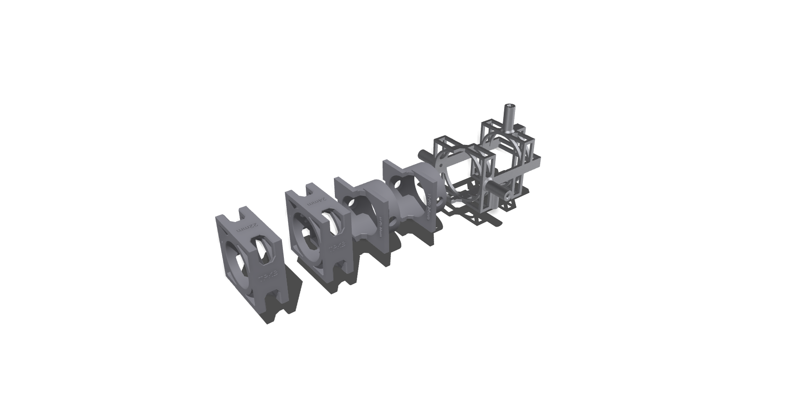
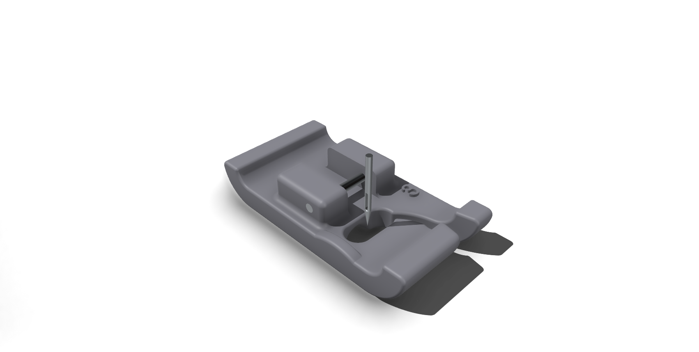

# Tools

This directory provides recommendations and resources for the tools required to assemble, service, and maintain ThePerfectKiteBar. Having the right tools is crucial for seamless assembly and safe operation.

## Material Recommendations for Tools

Choosing the right material for your custom 3D-printed tools and jigs is essential for their functionality and longevity.

## Jigs for drilling

This section contains designs for jigs to help with precise drilling of the carbon tube

| Component | Recommended Material | 3D Printing Technology | Notes |
|---|---|---|---|
| Main Jig | [316L Stainless Steel](https://jlc3dp.com/help/article/316L-Stainless-Steel) | SLM | The main jig is the metal part shown below; it is compatible with tubes of any diameter. |
| Jig Adapters & Inserts | [CBY Photosensitive Resin](https://jlc3dp.com/help/article/CBY-Photosensitive-Resin) | SLA | The plastic parts are shown in the picture below. Select the diameter (22mm or 24mm) that matches your bar's carbon tube. |

Below is a preview of the drilling tool set. You will need all plastic parts for one diameter. If you want to drill both 22mm and 24mm tubes, order two sets of plastic parts (eight total).

## Presser foot for sewing splices

A custom presser foot is recommended for sewing splices.

| Component | Recommended Material | 3D Printing Technology | Notes |
|---|---|---|---|
| Presser Foot | [CBY Photosensitive Resin](https://jlc3dp.com/help/article/CBY-Photosensitive-Resin) | SLA | One foot is needed for each rope diameter. |

Print a presser foot for each rope diameter you will be working with, for example: 1.1mm (thin lines), 1.7mm (thicker lines), and 3mm (pigtails and leaders).

**Note:** The main 4mm depower line requires manual sewing with a whipping twine.

