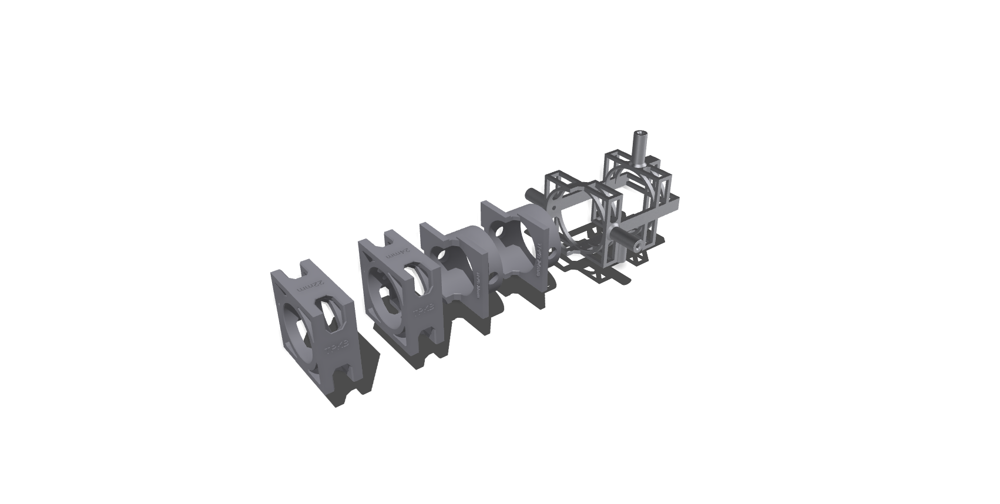
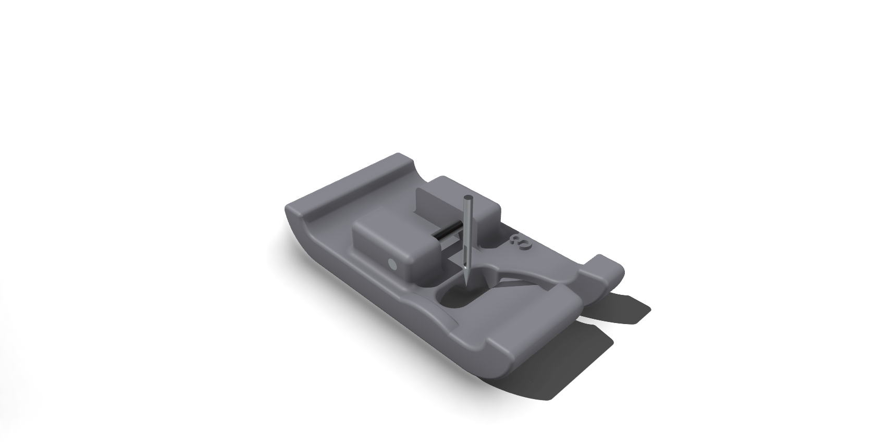

# Tools & Jigs

This directory provides CAD models and specifications for custom 3D-printed tools and jigs required to build, assemble, and maintain ThePerfectKiteBar. Having precise jigs ensures high-quality assembly and safe operation.

---

## 1. Drilling Jigs

The drilling jigs are designed to help you drill clean, centered, and perfectly aligned holes in your carbon fiber tube to install the central piece.

### Material Recommendations
* **Main Drill Guide**: Must be printed in **316L Stainless Steel** using **SLM** technology (Selective Laser Melting). The steel construction prevents the drill bit from eating into the guide.
* **Jig Adapters & Inserts**: Printed in **Photosensitive Resin** using **SLA** technology. Choose the size (22mm or 24mm) that matches your carbon tube.

### Parts list & Design Files
All drilling tools are located in [`drilling/2mm_bolt/`](drilling/2mm_bolt). You will need one main guide and a matching pair of alignment jigs and adapters for your tube diameter:

| Component | Tube Size | STEP (Parametric) | STL (Print-Ready) | Notes |
|-----------|-----------|-------------------|-------------------|-------|
| **Main Drill Guide** | Universal | [drill-guide_od22-od24_slm.step](drilling/2mm_bolt/drill-guide_od22-od24_slm.step) | [drill-guide_od22-od24_slm.stl](drilling/2mm_bolt/drill-guide_od22-od24_slm.stl) | Metal insert guide. |
| **Alignment Jig** | OD 22mm | [alignment_jig_od22_sla.step](drilling/2mm_bolt/alignment_jig_od22_sla.step) | [alignment_jig_od22_sla.stl](drilling/2mm_bolt/alignment_jig_od22_sla.stl) | Guides the carbon tube. |
| **Alignment Jig** | OD 24mm | [alignment_jig_od24_sla.step](drilling/2mm_bolt/alignment_jig_od24_sla.step) | [alignment_jig_od24_sla.stl](drilling/2mm_bolt/alignment_jig_od24_sla.stl) | Guides the carbon tube. |
| **Drill Guide Adapter** | OD 22mm | [drill-guide-adapter_od22_sla.step](drilling/2mm_bolt/drill-guide-adapter_od22_sla.step) | [drill-guide-adapter_od22_sla.stl](drilling/2mm_bolt/drill-guide-adapter_od22_sla.stl) | Adapts guide to tube. |
| **Drill Guide Adapter** | OD 24mm | [drill-guide-adapter_od24_sla.step](drilling/2mm_bolt/drill-guide-adapter_od24_sla.step) | [drill-guide-adapter_od24_sla.stl](drilling/2mm_bolt/drill-guide-adapter_od24_sla.stl) | Adapts guide to tube. |

---

## 2. Sewing Presser Feet

Custom sewing presser feet designed for **SINGER 44xx Series Heavy Duty** sewing machines. These feet center the lines and ropes automatically under the needle, ensuring clean, symmetrical, and structural bar-tack sewing splices.

### Material Recommendations
* **Material**: **Photosensitive Resin** printed with **SLA** technology (e.g., CBY resin). Smooth finishing is required to prevent catching on the line fibers.

### Parts list & Design Files
All sewing tools are located in [`sewing/SINGER_44xx/`](sewing/SINGER_44xx):

| Target Line/Rope Diameter | STEP (Parametric) | STL (Print-Ready) | Notes |
|---------------------------|-------------------|-------------------|-------|
| **1.1mm lines** (e.g. steering lines) | [presser_foot_1.1mm_line_sla.step](sewing/SINGER_44xx/presser_foot_1.1mm_line_sla.step) | [presser_foot_1.1mm_line_sla.stl](sewing/SINGER_44xx/presser_foot_1.1mm_line_sla.stl) | For splicing thin flight lines. |
| **1.4mm lines** (standard lines) | [presser_foot_1.4mm_line_sla.step](sewing/SINGER_44xx/presser_foot_1.4mm_line_sla.step) | [presser_foot_1.4mm_line_sla.stl](sewing/SINGER_44xx/presser_foot_1.4mm_line_sla.stl) | For splicing standard flight lines. |
| **1.7mm lines** (heavy front lines) | [presser_foot_1.7mm_line_sla.step](sewing/SINGER_44xx/presser_foot_1.7mm_line_sla.step) | [presser_foot_1.7mm_line_sla.stl](sewing/SINGER_44xx/presser_foot_1.7mm_line_sla.stl) | For splicing thicker front flight lines. |
| **3mm ropes** (leaders & pigtails) | [presser_foot_3mm_rope_sla.step](sewing/SINGER_44xx/presser_foot_3mm_rope_sla.step) | [presser_foot_3mm_rope_sla.stl](sewing/SINGER_44xx/presser_foot_3mm_rope_sla.stl) | For splicing steering leader lines. |

*Note: The main 4mm sheeting/depower line is too thick for mechanical sewing and must be whipped/sewn manually using whipping twine.*
