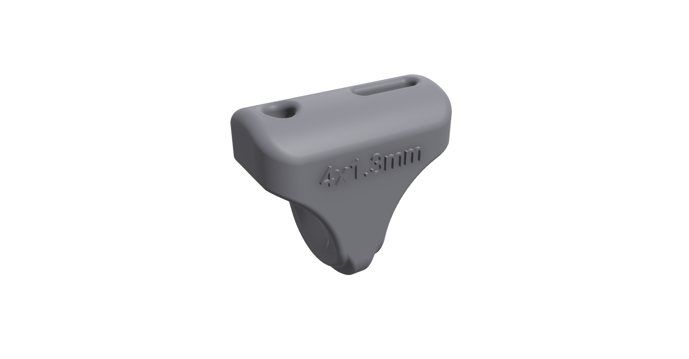
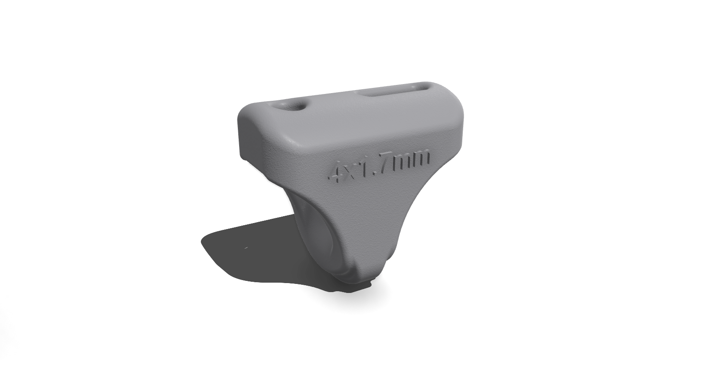

# V-Splitter

The **V-Splitter** is an essential part of the trim system. It connects the **main depower (trim) line** to the two **front flying lines**, creating a so called low V-split.

This V-splitter design features a **top horizontal part** where the front lines attach. When the top of the V-splitter sits **perfectly horizontal** (assuming kite is at 12 o'clock), it visually confirms that the **back (power) lines have been trimmed to equal length**, ensuring precise and symmetrical trim. This makes trim or not trim decision easy if you see that v-splitter is side-ways - probably is good idea to trim.

This project supports **only 4mm sheeting rope** throughout — ensuring compatibility, low weight, and modularity across all bar components. See note below about splitter for 8mm sheeting rope.

---

## Supported Design (TPKB Standard)

The following V-Splitter variants are recommended for use with ThePerfectKiteBar system:

| Sheeting Rope | Front Line | Variant | Technology | Material | Files | Preview |
|---------------|------------|---------|------------|----------|-------|---------|
| 4mm           | 1.4mm      | 3       | MJF        | PA12     | [`Files`](sheeting_rope_4mm/front_line_1.4mm/v-splitter/variant_3) |  |
| 4mm           | 1.7mm      | 3       | MJF        | PA12     | [`Files`](sheeting_rope_4mm/front_line_1.7mm/v-splitter/variant_3) |  |

---

## Optional / Legacy Compatibility

The following variant is **not part of this system** but provided as an often hard to get replacement part for off-the-shelf bars that use thicker rope and front lines.

| Sheeting Rope | Front Line | Variant | Technology | Material | Files |
|---------------|------------|---------|------------|----------|-------|
| 8mm           | 2mm        | 3       | MJF        | PA12     | [`Files`](sheeting_rope_8mm/front_line_2mm/v-splitter/variant_3) |

> ⚠️ Use only if you are adapting the V-splitter for a different bar system.  
> This is not compatible with the TPKB bar or trim system at the moment.

---

## Material & Printing Guidelines

- **Technology:** Multi Jet Fusion (MJF) strongly recommended as this is a critical part
- **Material:** PA12 HP Nylon (UV-resistant and tested in harsh conditions)
- **Coloring:** Optional, default grey or black; dyeing not required

---

## Assembly Notes

- Mounts inline between front lines and depower line
- Position correctly so that safety line (through hole) is aligned with the cleat base

## Native Shapr3D Design Files

The following `.shapr` files are the editable source models created in Shapr3D. Each file includes full parametric definitions—sketches, constraints, and feature history—so you can open and modify them directly in Shapr3D (iOS/iPadOS/macOS).

<!-- BEGIN_SHAPR_TABLE -->
<!-- Auto-generated Shapr3D download table. Do not edit manually. -->
| File | MD5 | Last Modified | Download URL |
|------|-----|---------------|--------------|
| `cleat-base_stopper_4_mjf.shapr` | `8448103e08f951ae36154b575d59a5ce` | 2025-05-03 02:13:46 | [Download](https://storage.googleapis.com/theperfectkitebar-cad-assets/trim/sheeting_rope_4mm/cleat/variant_3/cleat-base_stopper_4_mjf.shapr) |
| `line_stopper_14_mjf.shapr` | `4c48d73286f5f85ffe034c65127c51ed` | 2025-05-02 03:56:54 | [Download](https://storage.googleapis.com/theperfectkitebar-cad-assets/trim/sheeting_rope_4mm/front_line_1.4mm/safety_stopper/variant_3/line_stopper_14_mjf.shapr) |
| `v-splitter_4x14_mjf.shapr` | `20e751af154d15448be2f30b121adeea` | 2025-05-02 03:56:56 | [Download](https://storage.googleapis.com/theperfectkitebar-cad-assets/trim/sheeting_rope_4mm/front_line_1.4mm/v-splitter/variant_3/v-splitter_4x14_mjf.shapr) |
| `line_stopper_17_mjf.shapr` | `b019222a8a04ae55bade8134e7606bce` | 2025-05-02 03:56:45 | [Download](https://storage.googleapis.com/theperfectkitebar-cad-assets/trim/sheeting_rope_4mm/front_line_1.7mm/safety_stopper/variant_3/line_stopper_17_mjf.shapr) |
| `v-splitter_4x17_mjf.shapr` | `51b4313488d02281ff436c7bc2362fbe` | 2025-05-02 03:56:48 | [Download](https://storage.googleapis.com/theperfectkitebar-cad-assets/trim/sheeting_rope_4mm/front_line_1.7mm/v-splitter/variant_3/v-splitter_4x17_mjf.shapr) |
| `v-splitter_8x2_mjf.shapr` | `6fd88e410f9430fb92e16d165d14cd2b` | 2025-05-03 02:13:46 | [Download](https://storage.googleapis.com/theperfectkitebar-cad-assets/trim/sheeting_rope_8mm/front_line_2mm/v-splitter/variant_3/v-splitter_8x2_mjf.shapr) |
<!-- END_SHAPR_TABLE -->
