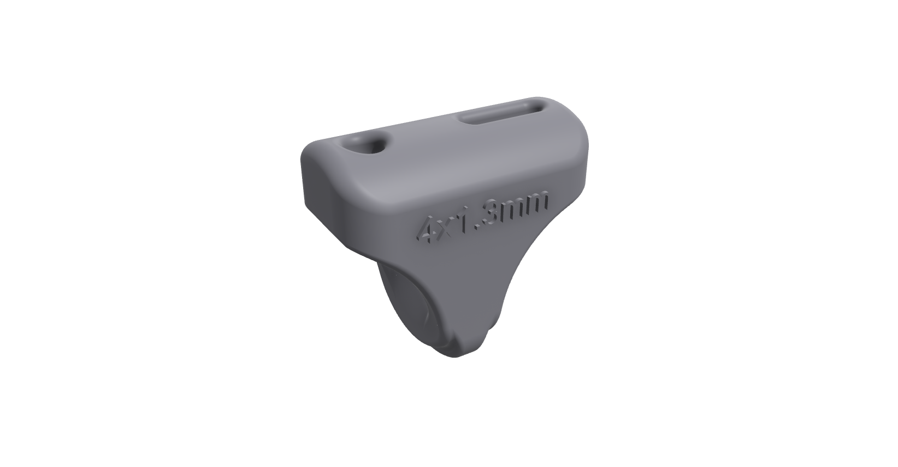
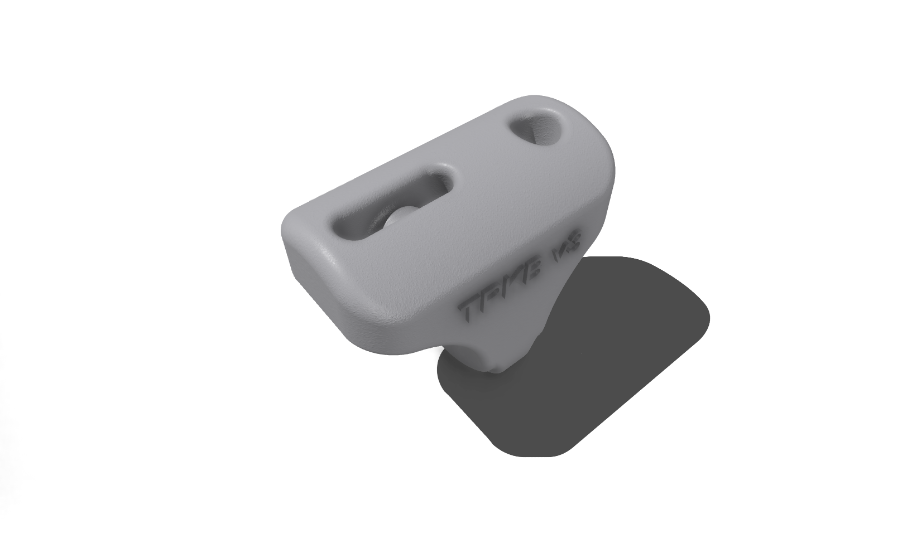
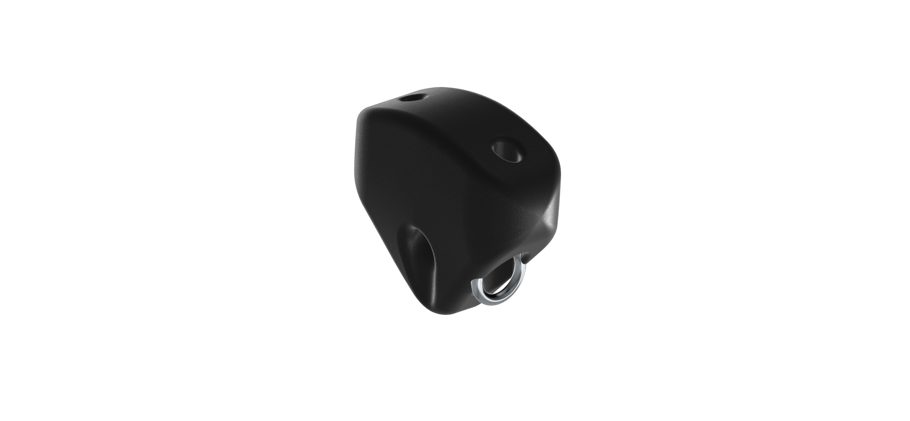
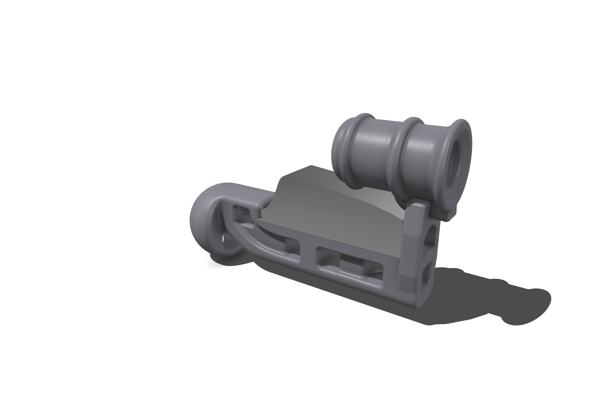
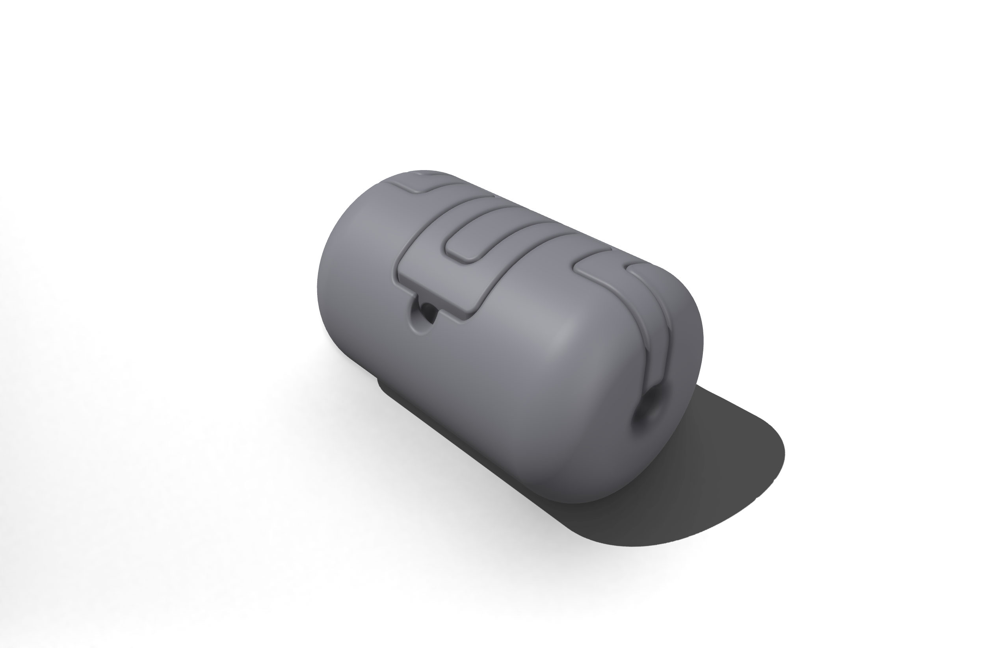

# Trim Components

The **Trim** system allows the rider to adjust the power of the kite on the fly by changing the relative length of the front flying lines. It consists of the **V-Splitter** (which connects the depower line to the front lines), the **Cleat Base** (which locks the trim adjuster line), and **Safety Line Stoppers**.

---

## 1. V-Splitters

The V-Splitter connects the single **sheeting (depower) line** to the two **front flying lines** (low V-split configuration). 

### Trim Symmetrical Guide
The top bar of the V-Splitter is designed to sit **perfectly horizontal** when the kite is at 12 o'clock. If the V-Splitter is tilted sideways, it visually signals to the rider that the lines are out of trim, indicating it's time to adjust.

### Sizing and Variant Breakdown
Different variants are optimized for specific sheeting rope and front flying line diameters:

| Sheeting Rope | Front Line | Variant | Description | CAD/3D Files | Preview Image |
|---------------|------------|---------|-------------|--------------|---------------|
| **4mm** | 1.4mm | **Variant 3** | **TPKB Standard.** Features smooth-radius safety line routing and reinforced structure. | [STEP](sheeting_rope_4mm/front_line_1.4mm/v-splitter/variant_3/v-splitter_4x14_mjf.step) \| [STL](sheeting_rope_4mm/front_line_1.4mm/v-splitter/variant_3/v-splitter_4x14_mjf.stl) |  |
| **4mm** | 1.7mm | **Variant 3** | **TPKB Heavy Duty.** Similar to the 1.4mm variant but optimized for thicker 1.7mm front lines. | [STEP](sheeting_rope_4mm/front_line_1.7mm/v-splitter/variant_3/v-splitter_4x17_mjf.step) \| [STL](sheeting_rope_4mm/front_line_1.7mm/v-splitter/variant_3/v-splitter_4x17_mjf.stl) |  |
| **6mm** | 2.0mm | **Variant 1** | Standard geometry designed for heavier 6mm depower lines and 2.0mm front lines. | [STEP](sheeting_rope_6mm/front_line_2mm/v-splitter/variant_1/v-splitter_6x20_mjf.step) \| [STL](sheeting_rope_6mm/front_line_2mm/v-splitter/variant_1/v-splitter_6x20_mjf.stl) |  |
| **8mm (Legacy)** | 2.0mm | **Variant 3** | Legacy compatibility part for thick 8mm depower lines on standard off-the-shelf bars. *Not used in standard TPKB.* | [STEP](sheeting_rope_8mm/front_line_2mm/v-splitter/variant_3/v-splitter_8x2_mjf.step) \| [STL](sheeting_rope_8mm/front_line_2mm/v-splitter/variant_3/v-splitter_8x2_mjf.stl) | *(None)* |

---

## 2. Cleat Base & Stopper

The **Cleat Base** mounts on the sheeting line directly below the V-Splitter. It houses the mechanical clam cleat to lock the trim adjustment rope securely in place under load. The matching **Trim Stopper** acts as a physical block to prevent the control bar from sliding too high.

### Sizing and Variant Breakdown
Designed specifically for the standard **4mm sheeting rope** track (Variant 3):

* **Cleat Base**: The main structural body housing the cleat.
  * **Files**: [STEP (Parametric)](sheeting_rope_4mm/cleat/variant_3/cleat-base_stopper_4_mjf.step) \| [STL (Print-Ready)](sheeting_rope_4mm/cleat/variant_3/cleat-base_4_mjf.stl)
* **Trim Stopper**: Installed on the sheeting line as a limit stop.
  * **Files**: [STL (Print-Ready)](sheeting_rope_4mm/cleat/variant_3/trim_stopper_4_mjf.stl)

---

## 3. Safety Line Stoppers

The **Safety Line Stopper** slides onto the safety flying line. When the quick release is triggered, the bar slides up the safety line and hits this stopper, which flags out the kite safely without allowing the bar to slide too far up the lines.

### Sizing and Variant Breakdown
Available for 1.4mm and 1.7mm front lines:

* **For 1.4mm Front Lines**:
  * **Files**: [STEP](sheeting_rope_4mm/front_line_1.4mm/safety_stopper/variant_3/line_stopper_14_mjf.step) \| [STL (Stopper)](sheeting_rope_4mm/front_line_1.4mm/safety_stopper/variant_3/line_stopper_14_mjf.stl) \| [STL (Knot Plug)](sheeting_rope_4mm/front_line_1.4mm/safety_stopper/variant_3/line_stopper_plug_14_mjf.stl)
  * **Preview**: 
* **For 1.7mm Front Lines**:
  * **Files**: [STEP](sheeting_rope_4mm/front_line_1.7mm/safety_stopper/variant_3/line_stopper_17_mjf.step) \| [STL (Stopper)](sheeting_rope_4mm/front_line_1.7mm/safety_stopper/variant_3/line_stopper_17_mjf.stl) \| [STL (Knot Plug)](sheeting_rope_4mm/front_line_1.7mm/safety_stopper/variant_3/line_stopper_plug_17_mjf.stl)

---

## Manufacturing & Materials

* **Technology**: **Multi Jet Fusion (MJF)** is highly recommended. These are structural, high-stress parts that require isotropic strength and high dimensional accuracy.
* **Material**: **PA12 HP Nylon** (black or dark grey, unpolished or polished). Excellent UV and saltwater resistance.

---

## Native Shapr3D Design Files

The following `.shapr` files are the editable source models created in Shapr3D. Each file includes full parametric definitions—sketches, constraints, and feature history—so you can open and modify them directly in Shapr3D (iOS/iPadOS/macOS).

<!-- BEGIN_SHAPR_TABLE -->
<!-- Auto-generated Shapr3D download table. Do not edit manually. -->
| File | MD5 | Last Modified | Download URL |
|------|-----|---------------|--------------|
| `cleat-base_stopper_4_mjf.shapr` | `8448103e08f951ae36154b575d59a5ce` | 2025-06-07 20:08:35 | [Download](https://storage.googleapis.com/theperfectkitebar-cad-assets/trim/sheeting_rope_4mm/cleat/variant_3/cleat-base_stopper_4_mjf.shapr) |
| `line_stopper_14_mjf.shapr` | `4c48d73286f5f85ffe034c65127c51ed` | 2025-05-02 03:56:54 | [Download](https://storage.googleapis.com/theperfectkitebar-cad-assets/trim/sheeting_rope_4mm/front_line_1.4mm/safety_stopper/variant_3/line_stopper_14_mjf.shapr) |
| `v-splitter_4x14_mjf.shapr` | `20e751af154d15448be2f30b121adeea` | 2025-05-02 03:56:56 | [Download](https://storage.googleapis.com/theperfectkitebar-cad-assets/trim/sheeting_rope_4mm/front_line_1.4mm/v-splitter/variant_3/v-splitter_4x14_mjf.shapr) |
| `line_stopper_17_mjf.shapr` | `b019222a8a04ae55bade8134e7606bce` | 2025-05-02 03:56:45 | [Download](https://storage.googleapis.com/theperfectkitebar-cad-assets/trim/sheeting_rope_4mm/front_line_1.7mm/safety_stopper/variant_3/line_stopper_17_mjf.shapr) |
| `v-splitter_4x17_mjf.shapr` | `51b4313488d02281ff436c7bc2362fbe` | 2025-05-02 03:56:48 | [Download](https://storage.googleapis.com/theperfectkitebar-cad-assets/trim/sheeting_rope_4mm/front_line_1.7mm/v-splitter/variant_3/v-splitter_4x17_mjf.shapr) |
| `v-splitter_6x20_mjf.shapr` | `75c6516e03f86d0abf7c153b188e3ead` | 2025-06-07 20:08:35 | [Download](https://storage.googleapis.com/theperfectkitebar-cad-assets/trim/sheeting_rope_6mm/front_line_2mm/v-splitter/variant_1/v-splitter_6x20_mjf.shapr) |
| `v-splitter_8x2_mjf.shapr` | `6fd88e410f9430fb92e16d165d14cd2b` | 2025-06-07 20:08:34 | [Download](https://storage.googleapis.com/theperfectkitebar-cad-assets/trim/sheeting_rope_8mm/front_line_2mm/v-splitter/variant_3/v-splitter_8x2_mjf.shapr) |
<!-- END_SHAPR_TABLE -->
