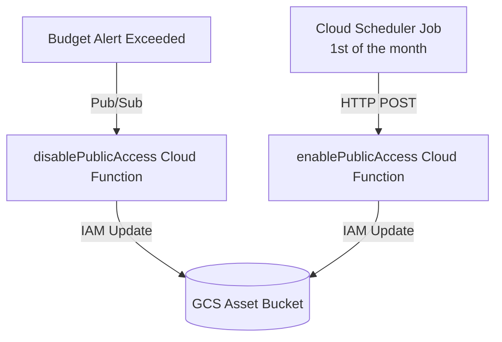

# Google Cloud Infrastructure & Functions

This directory contains the Terraform configuration and Python Cloud Functions to deploy and manage the public asset hosting infrastructure for ThePerfectKiteBar.

## The Big Picture: Egress Cost Protection

Hosting CAD models (`.stl`, `.step`, `.shapr`) for public download on Google Cloud Storage (GCS) can lead to unpredictable bandwidth egress costs if the designs become popular. To ensure the project remains cost-controlled, this infrastructure automatically revokes public access when a budget limit is hit.

---

## Infrastructure Architecture

The infrastructure consists of:

1. **GCS Asset Bucket (`theperfectkitebar-cad-assets`)**: Public bucket where CAD files are stored and served.
2. **GCS Code Bucket (`theperfectkitebar-fn-code`)**: Private bucket where zipped Cloud Function code is uploaded.
3. **Pub/Sub Topic (`cad-budget-alerts`)**: Connects to the GCP Billing Budget so that alerts publish messages to this topic.
4. **Cloud Scheduler Job (`reenable-public-access`)**: Runs monthly to trigger the enabling function.

### Cloud Functions (Python 3.12 / Gen 2)

* **`disablePublicAccess`**:
  * **Trigger**: Subscribed to the `cad-budget-alerts` Pub/Sub topic.
  * **Action**: Parses the budget alert payload. If the display name matches the configured budget and the alert threshold is exceeded, it removes `allUsers` from the `roles/storage.objectViewer` binding on the asset bucket (effectively disabling public downloads).
* **`enablePublicAccess`**:
  * **Trigger**: HTTP POST endpoint.
  * **Action**: Adds the `allUsers` member back to the bucket's `roles/storage.objectViewer` policy binding, restoring public downloads.

---

## File Reference

* **`cad2gcp/`**: The primary Terraform module containing infrastructure resource definitions.
* **`cad2gcp/src/main.py`**: Function entry points that dispatch to the handlers.
* **`cad2gcp/src/disable_public_access.py`**: Budget-alert handler that removes public access.
* **`cad2gcp/src/enable_public_access.py`**: HTTP handler that restores public access.
* **`cad2gcp/variables.tf`**: Input variables, including the budget display name.

The Terraform module defines the Pub/Sub topic but does not create the billing budget. Configure that budget separately to publish to `cad-budget-alerts`, using the matching display name. These files describe the intended deployment; they do not establish its current live status.
